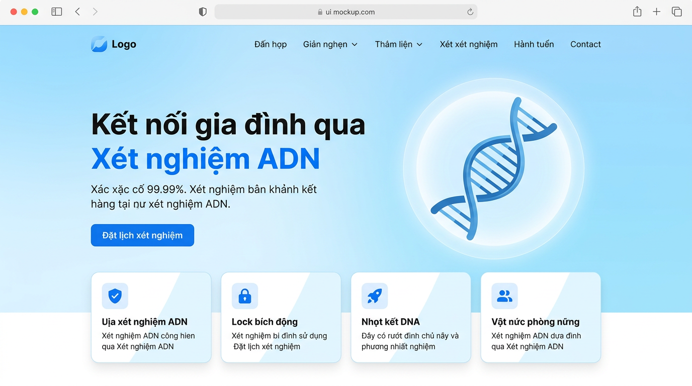

# 🧬 ADN Huyết Thống (Next.js + Supbase)

## Xem trước giao diện



<div align="center">
✨ <h1><strong> Tính năng nổi bật</strong> </h1>
 
| Tính năng | Mô tả |
|-----------|-------|
| 🛡️ **Độ chính xác 99.99%** | Công nghệ phân tích ADN tiên tiến đảm bảo kết quả đáng tin cậy |
| 🔒 **Bảo mật tuyệt đối** | Dữ liệu được mã hóa, tuân thủ tiêu chuẩn bảo mật quốc tế |
| 🚀 **Kết quả nhanh chóng** | Nhận kết quả trong 3–5 ngày làm việc, hỗ trợ giao tận nơi |
| 👥 **Hỗ trợ chuyên gia** | Đội ngũ tư vấn 24/7, giải đáp mọi thắc mắc về xét nghiệm |
 
---
 
🔬 <h1><strong>Quy trình</strong> </h1>
 
```
📅 Đặt lịch  ──▶  🧪 Lấy mẫu  ──▶  🧬 Phân tích  ──▶  📄 Nhận kết quả
   Đăng ký          Tại cơ sở         Phòng thí           Email bảo mật
   trực tuyến       hoặc tại nhà      nghiệm hiện đại     hoặc giao tay
```
 
1. **Đặt lịch** — Đăng ký trực tuyến hoặc liên hệ hotline để đặt lịch lấy mẫu
2. **Lấy mẫu** — Lấy mẫu ADN đơn giản tại cơ sở hoặc dịch vụ tại nhà
3. **Phân tích** — Mẫu được phân tích trong phòng thí nghiệm hiện đại, đạt chuẩn quốc tế
4. **Nhận kết quả** — Kết quả được gửi qua email bảo mật hoặc giao trực tiếp

</div>
